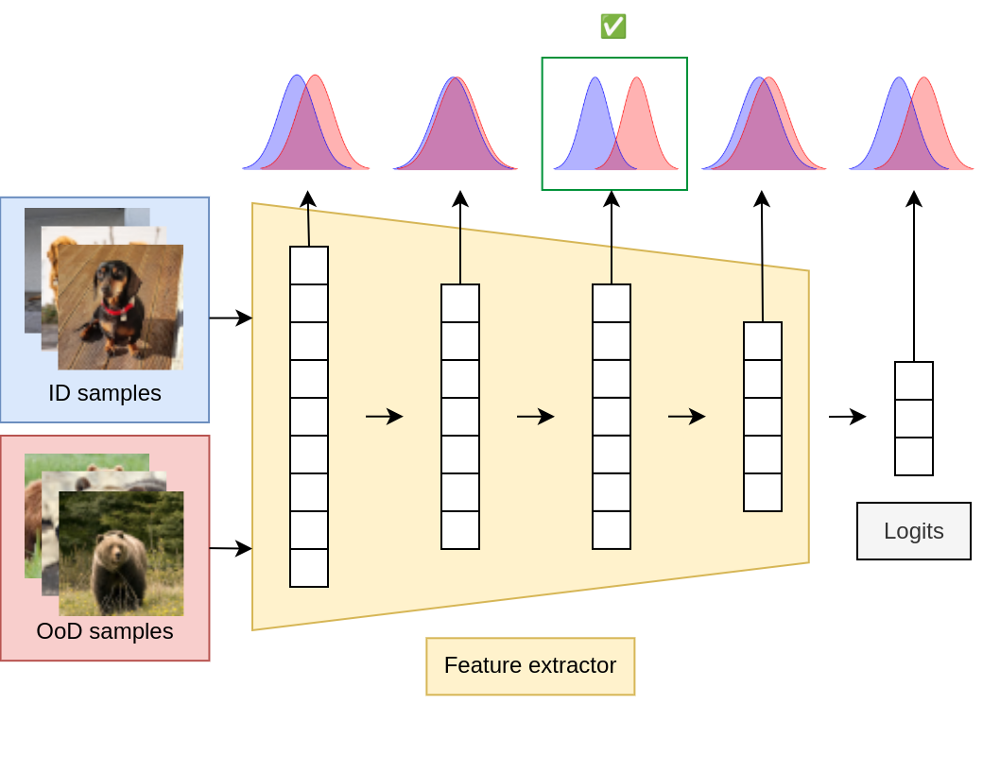

# Leveraging Intermediate Representations for better OoD Detection 🌀
This is the source code for the paper Leveraging Intermediate Representations for Better Out-of-Distribution Detection by Gianluca Guglielmo and Marc Masana.

The paper explores how intermediate layer embeddings can be more discriminative for OoD detection than the penultimate and final layers, and proposes methods to either aggregate these signals or regularize them during training.

<p align="center">
    
</p>

---

## 📌 Overview

This toy example uses:
- **CIFAR-10, CIFAR-100** as in-distribution (ID) datasets.
- **CIFAR-10, CIFAR-100, SVHN, MNIST, FashionMNIST** as out-of-distribution (OOD) datasets.
- A **ResNet18** (with pretrained weights) as the backbone.

The script registers forward hooks on selected layers (convolutional, linear, and batch normalization layers) to collect the energy of activations from each sample. It then computes the AUROC score per layer comparing ID vs. OOD activations, plots these scores in network order, and highlights any intermediate layer that outperforms the final fully-connected (fc) layer.

After running the script, you will obtain a **bar plot** with the AUROC calculated for each layer of the model. The **dotted line** indicates the AUROC of the final layer. Green layers are the ones that beat the final layer.


---

## 🎯 Motivation

In many real-world applications, neural networks may encounter data that do not belong to the distribution on which they were trained. Detecting such OoD samples is critical to prevent unsafe decisions in areas such as autonomous driving, healthcare, or finance. Traditional methods mostly rely on the final layer (logits or penultimate features) for OoD detection. However, as highlighted in the paper, the rich information contained in intermediate layers can provide earlier and more robust signals for OoD detection. One of the advantages is to serve as an early stop to avoid computational overhead.  

This repository offers a simplified, easy-to-run implementation of these ideas.

---

## 🚀 How to Run

### 📦 Requirements

- Python 3.7+
- PyTorch
- torchvision
- scikit-learn
- matplotlib

You can install the necessary dependencies with:

```bash
pip install torch torchvision scikit-learn matplotlib
```

### ▶ Running the Script

Clone the repository and run the script from the command line:

```bash
python run.py --in_dataset cifar10 --out_datasets svhn
```
---

## 📚 References

If you use or extend this work, please cite the original paper:

```bibtex
@inproceedings{guglielmo2025leveraging,
  author    = {Gianluca Guglielmo and Marc Masana},
  title     = {Leveraging Intermediate Representations for Better Out-of-Distribution Detection},
  booktitle = {28th Computer Vision Winter Workshop (CVWW)},
  year      = {2025}}
```
